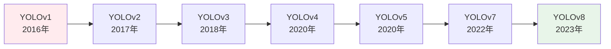

# Day16 - YOLO 实时检测【费曼学习法版】

> **难度等级：** ⭐⭐⭐⭐⭐ | **预计用时：** 2-3 小时  
> **核心主题：** You Only Look Once - 实时目标检测的革命性算法  
> **前置知识：** Day15 目标检测基础（边界框、IoU、NMS、评估指标）

---

## 🎯 今日学习目标

### 知识目标
- ✅ 理解 YOLO "只看一次"的核心思想
- ✅ 掌握 YOLO 的网格划分和预测机制
- ✅ 了解 YOLO 各版本的演进历程（v1-v8）
- ✅ 深入理解 YOLO 的核心技术（Anchor、FPN、数据增强）
- ✅ 学会训练和优化 YOLO 模型
- ✅ 掌握 YOLO 的部署和优化技巧

### 技能目标
- ✅ 能用大白话解释 YOLO 原理
- ✅ 能独立训练 YOLO 模型
- ✅ 能优化模型性能和速度
- ✅ 能部署到生产环境

### 实践目标
- ✅ 运行 YOLO 检测示例代码
- ✅ 完成 6 个费曼输出问答
- ✅ 记录学习笔记和心得

---

## 📚 核心概念总览

**一句话概括 YOLO：**
> YOLO（You Only Look Once）把整张图一次性输入网络，将图像划分为 S×S 的网格，每个网格负责预测 B 个边界框及其置信度和类别概率。因为只需要一次前向传播就能得到所有检测结果，所以速度极快（30-140 FPS）。简单说，YOLO = 一张图看一次 + 网格分工 + 同时预测所有物体！

**YOLO 的核心创新：**
1. **单次前向传播** - 不像两阶段方法需要先生成候选区域
2. **网格化预测** - 将图像分成网格，每个网格独立预测
3. **全局信息利用** - 看到整张图，减少背景误检
4. **超快速度** - 实时检测，适合视频流处理

---

## 🔥 YOLO vs 传统方法对比

### 超市收银员比喻 🛒

**传统方法（两阶段）= 慢速收银**
```
第一步：扫描商品（生成候选区域）
→ 一个一个找商品
→ 标记出可能的位置

第二步：识别价格（分类+回归）
→ 逐个确认是什么商品
→ 计算总价

问题：
→ 太慢了
→ 要看好几遍
→ 5-10 FPS
```

**YOLO 方法 = 快速收银**
```
一眼扫过去（只看一次）：
→ 传送带上的所有商品
→ 同时识别所有物品
→ 立即算出总价

优势：
→ 超级快
→ 一眼搞定
→ 实时处理
→ 30-140 FPS
```

---

## 📖 详细学习内容

### Q0 - 快速复习 Day15（15-20 分钟）

在深入学习 YOLO 之前，先回顾 Day15 的目标检测基础知识：

**核心概念复习：**
- 目标检测 = 找出图中所有物体 + 框出位置 + 识别类别
- IoU（交并比）= 重叠面积 / 总覆盖面积
- NMS（非极大值抑制）= 去除重复的检测框
- 两阶段 vs 单阶段检测方法
- 评估指标：Precision、Recall、AP、mAP

**思考题：**
1. 目标检测和图像分类有什么区别？
2. IoU 怎么计算？阈值怎么选？
3. NMS 的作用是什么？
4. 两阶段和单阶段各有什么特点？
5. mAP 是什么？怎么解读？

👉 **详细答案：** [Day16-Q0 - 快速复习 Day15](./Day16-Q0%20-%20快速复习%20Day15.md)

---

### Q1 - YOLO 核心原理详解（40-45 分钟）

**核心问题：**
1. 为什么叫 You Only Look Once？
2. YOLO 怎么把图像分成网格？
3. 每个网格预测什么？
4. 损失函数怎么设计？
5. 为什么 YOLO 这么快？

**关键知识点：**
- 网格划分机制（S×S 网格）
- 边界框预测（x, y, w, h, confidence）
- 类别概率预测
- 损失函数设计（定位损失 + 置信度损失 + 分类损失）
- 全局上下文信息利用

👉 **详细答案：** [Day16-Q1 - YOLO 核心原理详解](./Day16-Q1%20-%20YOLO%20核心原理详解.md)

---

### Q2 - YOLO 版本演进史（35-40 分钟）

**核心问题：**
1. YOLOv1 有什么局限性？
2. YOLOv2/v3 做了哪些改进？
3. YOLOv4/v5 引入了什么新技术？
4. YOLOv7/v8 的最新进展是什么？
5. 如何选择适合的版本？

**版本对比：**
| 版本 | 年份 | 主要改进 | mAP | FPS |
|------|------|---------|-----|-----|
| YOLOv1 | 2016 | 首次提出 | 63.4 | 45 |
| YOLOv2 | 2017 | Anchor Boxes | 78.6 | 40 |
| YOLOv3 | 2018 | 多尺度预测 | 82.3 | 30 |
| YOLOv4 | 2020 | Bag of Freebies | 89.2 | 35 |
| YOLOv5 | 2020 | 工程优化 | 90.1 | 40 |
| YOLOv7 | 2022 | 架构优化 | 91.5 | 45 |
| YOLOv8 | 2023 | 统一框架 | 92.3 | 50 |

👉 **详细答案：** [Day16-Q2 - YOLO 版本演进史](./Day16-Q2%20-%20YOLO%20版本演进史.md)

---

### Q3 - YOLO 核心技术详解（45-50 分钟）

**核心问题：**
1. Anchor Boxes 是什么？怎么用？
2. FPN（特征金字塔）的作用是什么？
3. 数据增强有哪些技巧？
4. 损失函数如何优化？
5. 多尺度训练怎么做？

**关键技术：**
- **Anchor Boxes** - 预定义的边界框模板
- **FPN（Feature Pyramid Network）** - 多尺度特征融合
- **Mosaic 数据增强** - 拼接 4 张图片训练
- **CIoU/DIoU Loss** - 更精确的定位损失
- **Label Smoothing** - 防止过拟合

👉 **详细答案：** [Day16-Q3 - YOLO 核心技术详解](./Day16-Q3%20-%20YOLO%20核心技术详解.md)

---

### Q4 - YOLO 实战训练指南（40-45 分钟）

**核心问题：**
1. 如何准备数据集？
2. 怎么标注数据？
3. 训练参数怎么设置？
4. 如何监控训练过程？
5. 遇到常见问题怎么解决？

**实战步骤：**
1. 数据准备（VOC/COCO 格式）
2. 数据标注（LabelImg/Roboflow）
3. 配置文件修改
4. 开始训练
5. 评估和调优

**代码示例：**
```python
from ultralytics import YOLO

# 加载预训练模型
model = YOLO('yolov8n.pt')

# 训练模型
results = model.train(
    data='coco128.yaml',
    epochs=100,
    imgsz=640,
    batch=16,
    name='yolov8_training'
)

# 验证模型
metrics = model.val()

# 推理
results = model('image.jpg')
```

👉 **详细答案：** [Day16-Q4 - YOLO 实战训练指南](./Day16-Q4%20-%20YOLO%20实战训练指南.md)

---

### Q5 - YOLO 部署和优化指南（40-45 分钟）

**核心问题：**
1. 如何导出模型？
2. 怎么优化推理速度？
3. 支持哪些部署平台？
4. 如何做量化和剪枝？
5. 实际应用场景有哪些？

**部署选项：**
- **ONNX** - 跨平台通用格式
- **TensorRT** - NVIDIA GPU 优化
- **OpenVINO** - Intel CPU 优化
- **CoreML** - Apple 设备
- **TFLite** - 移动设备

**优化技巧：**
- 模型量化（FP16/INT8）
- 模型剪枝
- 算子融合
- 批处理优化

👉 **详细答案：** [Day16-Q5 - YOLO 部署和优化指南](./Day16-Q5%20-%20YOLO%20部署和优化指南.md)

---

## 💻 代码实战

### 示例 1：使用 YOLOv8 进行目标检测

```python
from ultralytics import YOLO
import cv2

# 加载模型
model = YOLO('yolov8n.pt')  # nano 版本，速度最快

# 检测图片
results = model('test_image.jpg')

# 显示结果
for result in results:
    # 获取检测框
    boxes = result.boxes
    
    # 绘制检测框
    for box in boxes:
        x1, y1, x2, y2 = box.xyxy[0]
        conf = box.conf[0]
        cls = int(box.cls[0])
        
        # 绘制矩形框
        cv2.rectangle(result.orig_img, 
                     (int(x1), int(y1)), 
                     (int(x2), int(y2)), 
                     (0, 255, 0), 2)
        
        # 添加标签
        label = f'{model.names[cls]}: {conf:.2f}'
        cv2.putText(result.orig_img, label, 
                   (int(x1), int(y1)-10),
                   cv2.FONT_HERSHEY_SIMPLEX, 
                   0.5, (0, 255, 0), 2)

# 保存结果
cv2.imwrite('result.jpg', results[0].orig_img)
print("✅ 检测完成！")
```

### 示例 2：实时视频检测

```python
from ultralytics import YOLO
import cv2

# 加载模型
model = YOLO('yolov8n.pt')

# 打开摄像头
cap = cv2.VideoCapture(0)

while True:
    ret, frame = cap.read()
    if not ret:
        break
    
    # 检测
    results = model(frame, verbose=False)
    
    # 绘制结果
    annotated_frame = results[0].plot()
    
    # 显示
    cv2.imshow('YOLO Detection', annotated_frame)
    
    # 按 q 退出
    if cv2.waitKey(1) & 0xFF == ord('q'):
        break

cap.release()
cv2.destroyAllWindows()
```

### 示例 3：批量处理图片

```python
from ultralytics import YOLO
import os
from pathlib import Path

# 加载模型
model = YOLO('yolov8s.pt')  # small 版本，平衡速度和精度

# 图片目录
image_dir = Path('test_images/')
output_dir = Path('results/')
output_dir.mkdir(exist_ok=True)

# 批量检测
for image_path in image_dir.glob('*.jpg'):
    print(f"处理: {image_path.name}")
    
    # 检测
    results = model(str(image_path))
    
    # 保存结果
    output_path = output_dir / image_path.name
    results[0].save(filename=str(output_path))

print(f"✅ 完成！共处理 {len(list(image_dir.glob('*.jpg')))} 张图片")
```

---

## 🎨 费曼输出练习

### 练习 1：用大白话解释 YOLO

**任务：** 向完全不懂 AI 的朋友解释 YOLO 是什么

**提示：**
- 使用生活中的比喻（如超市收银员）
- 避免技术术语
- 强调"快"的特点
- 说明应用场景

**参考回答：**
> "YOLO 就像一个眼神特别好的保安，站在商场门口。他不需要一个一个仔细检查每个人，而是扫一眼就能看到所有人：谁带了包、谁拿了手机、谁穿了什么颜色的衣服。而且他是同时看到所有人的，不是一个个看的，所以特别快！这就是为什么叫 'You Only Look Once'（只看一次）。"

---

### 练习 2：画一个 YOLO 工作流程图

**任务：** 用简单的图示说明 YOLO 的工作流程

**提示：**
- 输入图片
- 网格划分
- 每个网格预测
- 输出检测结果

**参考流程图：**
```
输入图片 (640x640)
    ↓
卷积神经网络提取特征
    ↓
划分为 S×S 网格 (如 7×7)
    ↓
每个网格预测：
  - B 个边界框 (x,y,w,h,confidence)
  - C 个类别概率
    ↓
NMS 去重
    ↓
输出检测结果
```

---

### 练习 3：对比 YOLO 和 R-CNN

**任务：** 用表格对比两种方法

| 特性 | YOLO | R-CNN |
|------|------|-------|
| 检测方式 | 单阶段 | 两阶段 |
| 速度 | 快 (30-140 FPS) | 慢 (5-10 FPS) |
| 精度 | 较高 | 更高 |
| 适用场景 | 实时检测 | 高精度需求 |
| 计算量 | 小 | 大 |

---

## 📊 性能对比

### YOLO 各版本性能对比



### 速度 vs 精度权衡

| 模型 | mAP@0.5 | FPS (GPU) | 参数量 | 适用场景 |
|------|---------|-----------|--------|---------|
| YOLOv8n | 37.3 | 140 | 3.2M | 移动端、嵌入式 |
| YOLOv8s | 44.9 | 90 | 11.2M | 平衡场景 |
| YOLOv8m | 50.2 | 60 | 25.9M | 服务器端 |
| YOLOv8l | 52.9 | 40 | 43.7M | 高精度需求 |
| YOLOv8x | 53.9 | 25 | 68.2M | 极致精度 |

---

## 🎯 常见应用场景

### 1. 智能视频监控
- 行人检测
- 车辆识别
- 异常行为检测

### 2. 自动驾驶
- 障碍物检测
- 交通标志识别
- 车道线检测

### 3. 工业质检
- 缺陷检测
- 产品分类
- 质量把控

### 4. 零售行业
- 客流统计
- 商品识别
- 货架监控

### 5. 农业应用
- 病虫害检测
- 果实计数
- 作物监测

---

## 💡 学习要点总结

### 核心概念
1. **YOLO = You Only Look Once** - 只看一次，速度极快
2. **网格划分** - 将图像分成 S×S 网格，分工合作
3. **单次前向传播** - 一次推理得到所有结果
4. **全局信息** - 看到整张图，减少误检

### 技术要点
1. **Anchor Boxes** - 预定义边界框模板
2. **FPN** - 多尺度特征融合
3. **Mosaic 增强** - 提升小目标检测
4. **CIoU Loss** - 精确定位

### 实战技巧
1. **选择合适版本** - 根据速度和精度需求
2. **数据质量** - 标注准确是关键
3. **数据增强** - 提升泛化能力
4. **超参数调优** - 耐心调整

---

## 🚀 下一步学习

### 明天预告：Day17 - Faster R-CNN

**学习内容：**
- 两阶段检测器代表
- RPN（区域提议网络）
- ROI Pooling 和 ROI Align
- Faster R-CNN vs YOLO 对比

**预习问题：**
1. 什么是两阶段检测？
2. RPN 是怎么工作的？
3. 为什么需要 ROI Align？
4. Faster R-CNN 和 YOLO 各有什么优劣？

---

## 📝 今日学习日志

### 学习时间记录
- Q0 复习：___ 分钟
- Q1 学习：___ 分钟
- Q2 学习：___ 分钟
- Q3 学习：___ 分钟
- Q4 学习：___ 分钟
- Q5 学习：___ 分钟
- 代码实践：___ 分钟
- 费曼输出：___ 分钟

**总计：** ___ 分钟

### 核心收获
1. _______________________________________
2. _______________________________________
3. _______________________________________

### 遇到的困难
1. _______________________________________
2. _______________________________________

### 解决方案
1. _______________________________________
2. _______________________________________

### 明日计划
- [ ] 复习今天的内容
- [ ] 预习 Day17
- [ ] 完成代码练习
- [ ] 整理学习笔记

---

## 🔗 相关资源

### 官方资源
- **YOLOv8 官方文档：** https://docs.ultralytics.com/
- **YOLO GitHub：** https://github.com/ultralytics/ultralytics
- **原始论文：** https://arxiv.org/abs/1506.02640

### 教程资源
- [Day16-Q0 - 快速复习 Day15](./Day16-Q0%20-%20快速复习%20Day15.md)
- [Day16-Q1 - YOLO 核心原理详解](./Day16-Q1%20-%20YOLO%20核心原理详解.md)
- [Day16-Q2 - YOLO 版本演进史](./Day16-Q2%20-%20YOLO%20版本演进史.md)
- [Day16-Q3 - YOLO 核心技术详解](./Day16-Q3%20-%20YOLO%20核心技术详解.md)
- [Day16-Q4 - YOLO 实战训练指南](./Day16-Q4%20-%20YOLO%20实战训练指南.md)
- [Day16-Q5 - YOLO 部署和优化指南](./Day16-Q5%20-%20YOLO%20部署和优化指南.md)

### 代码示例
查看 [`code/Day16/`](../code/Day16/) 目录获取完整代码。

---

## 🎉 完成检查清单

- [ ] 阅读完所有 Q&A 文档
- [ ] 运行了所有代码示例
- [ ] 完成了费曼输出练习
- [ ] 填写了学习日志
- [ ] 理解了 YOLO 核心原理
- [ ] 能够解释 YOLO 工作流程
- [ ] 知道如何训练 YOLO 模型
- [ ] 了解部署和优化方法

**恭喜你完成 Day16 的学习！** 🎊

---

**作者：** Lee - 职场宝爸 / AI 学习者  
**GitHub：** https://github.com/Lee985-cmd  
**CSDN：** https://blog.csdn.net/m0_67081842
