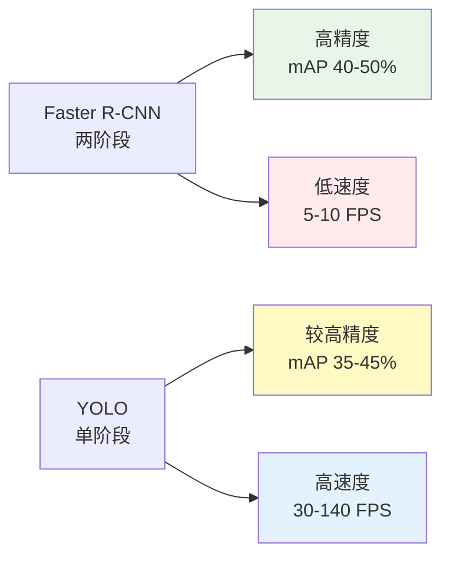

# Day17 - Faster R-CNN【费曼学习法版】

> **难度等级：** ⭐⭐⭐⭐⭐ | **预计用时：** 2-3 小时  
> **核心主题：** 两阶段目标检测的经典之作 - Faster R-CNN  
> **前置知识：** Day16 YOLO 实时检测（单阶段检测方法）

---

## 🎯 今日学习目标

### 知识目标
- ✅ 理解两阶段检测的核心思想
- ✅ 掌握 Faster R-CNN 的完整架构
- ✅ 深入理解 RPN（区域提议网络）
- ✅ 了解 ROI Pooling 和 ROI Align 的区别
- ✅ 学会训练和优化 Faster R-CNN
- ✅ 掌握 Faster R-CNN vs YOLO 的对比

### 技能目标
- ✅ 能用大白话解释两阶段检测
- ✅ 能独立训练 Faster R-CNN 模型
- ✅ 能根据场景选择合适的检测器
- ✅ 能优化模型性能

### 实践目标
- ✅ 运行 Faster R-CNN 检测示例代码
- ✅ 完成 6 个费曼输出问答
- ✅ 记录学习笔记和心得

---

## 📚 核心概念总览

**一句话概括 Faster R-CNN：**
> Faster R-CNN 是经典的两阶段目标检测算法：第一阶段用 Region Proposal Network (RPN) 生成候选区域（约 2000 个可能包含物体的框），第二阶段对这些候选区域进行分类和精调。因为分两步走，先找可能位置再仔细辨认，所以精度高但速度慢（5-10 FPS）。简单说，两阶段检测 = 先生成候选框 + 再分类回归，精但慢！

**Faster R-CNN 的核心创新：**
1. **两阶段架构** - 先生成候选区域，再精细分类
2. **RPN（Region Proposal Network）** - 端到端生成候选框
3. **ROI Pooling** - 将不同大小的区域统一尺寸
4. **多任务损失** - 同时优化分类和定位

---

## 🔥 两阶段 vs 单阶段对比

### 侦探破案比喻 🔍

**两阶段检测（Faster R-CNN）= 细心侦探**
```
第一阶段：寻找线索（生成候选）
→ 扫描整个犯罪现场
→ 标记出可疑的地方
→ 找出 2000 个可能的线索

第二阶段：仔细分析（分类+定位）
→ 逐个检查这 2000 个线索
→ 判断是不是真正的证据
→ 精确定位证据位置

特点：
→ 准确率高
→ 但耗时较长
→ 5-10 FPS
```

**单阶段检测（YOLO）= 快速保安**
```
一眼扫过去（只看一次）：
→ 传送带上的所有商品
→ 同时识别所有物品
→ 立即算出总价

优势：
→ 超级快
→ 一眼搞定
→ 实时处理
→ 30-140 FPS
```

---

## 📖 详细学习内容

### Q0 - 快速复习 Day16 YOLO（15-20 分钟）

在深入学习 Faster R-CNN 之前，先回顾 Day16 的 YOLO 知识：

**核心概念复习：**
- YOLO = You Only Look Once（只看一次）
- 网格划分机制（S×S 网格）
- Anchor Boxes 预定义模板
- Mosaic 数据增强
- 从 v1 到 v8 的版本演进

**思考题：**
1. YOLO 的核心思想是什么？
2. YOLO 有哪些版本？各有什么特点？
3. Anchor Boxes 的作用是什么？
4. Mosaic 数据增强怎么工作？
5. 如何训练和部署 YOLO 模型？

👉 **详细答案：** [Day17-Q0 - 快速复习 Day16 YOLO](./Day17-Q0%20-%20快速复习%20Day16%20YOLO.md)

---

### Q1 - 两阶段检测原理详解（40-45 分钟）

**核心问题：**
1. 什么是两阶段检测？
2. Faster R-CNN 的两个阶段分别做什么？
3. 为什么两阶段比单阶段准确？
4. 为什么两阶段比较慢？
5. Faster R-CNN 的架构是怎样的？

**关键知识点：**
- 两阶段检测流程
- RPN 工作原理
- ROI Pooling 机制
- 多任务损失函数
- 与 YOLO 的对比

👉 **详细答案：** [Day17-Q1 - 两阶段检测原理详解](./Day17-Q1%20-%20两阶段检测原理详解.md)

---

### Q2 - RPN 区域提议网络详解（35-40 分钟）

**核心问题：**
1. RPN 是什么？有什么用？
2. RPN 怎么生成候选框？
3. Anchor 在 RPN 中怎么用？
4. RPN 的损失函数怎么设计？
5. 如何优化 RPN 性能？

**关键技术：**
- RPN 网络结构
- Anchor 机制
- 正负样本选择
- 边界框回归
- 非极大值抑制（NMS）

👉 **详细答案：** [Day17-Q2 - RPN 区域提议网络详解](./Day17-Q2%20-%20RPN%20区域提议网络详解.md)

---

### Q3 - ROI Pooling 和 Align 详解（35-40 分钟）

**核心问题：**
1. 为什么需要 ROI Pooling？
2. ROI Pooling 怎么工作？
3. ROI Align 改进了什么？
4. 两者有什么区别？
5. 实际应用中怎么选？

**关键技术：**
- ROI Pooling 原理
- 量化误差问题
- ROI Align 双线性插值
- 精度对比
- 实现细节

👉 **详细答案：** [Day17-Q3 - ROI Pooling 和 Align 详解](./Day17-Q3%20-%20ROI%20Pooling%20和%20Align%20详解.md)

---

### Q4 - Faster R-CNN 实战训练详解（40-45 分钟）

**核心问题：**
1. 如何准备数据集？
2. 怎么配置训练参数？
3. 训练过程怎么监控？
4. 常见问题怎么解决？
5. 如何评估模型性能？

**实战步骤：**
1. 数据准备（VOC/COCO 格式）
2. 配置文件修改
3. 开始训练
4. 监控训练过程
5. 评估和调优

**代码示例：**
```python
import torchvision
from torchvision.models.detection import FasterRCNN
from torchvision.models.detection.rpn import AnchorGenerator

# 加载预训练模型
model = torchvision.models.detection.fasterrcnn_resnet50_fpn(
    pretrained=True
)

# 切换到训练模式
model.train()

# 定义优化器
params = [p for p in model.parameters() if p.requires_grad]
optimizer = torch.optim.SGD(params, lr=0.005, momentum=0.9, weight_decay=0.0005)

# 训练循环
for epoch in range(num_epochs):
    for images, targets in data_loader:
        loss_dict = model(images, targets)
        losses = sum(loss for loss in loss_dict.values())
        
        optimizer.zero_grad()
        losses.backward()
        optimizer.step()
```

👉 **详细答案：** [Day17-Q4 - Faster R-CNN 实战训练详解](./Day17-Q4%20-%20Faster%20R-CNN%20实战训练详解.md)

---

### Q5 - Faster R-CNN vs YOLO 对比详解（40-45 分钟）

**核心问题：**
1. 两者的核心区别是什么？
2. 精度对比如何？
3. 速度对比如何？
4. 各自适用什么场景？
5. 如何选择？

**对比维度：**
- 检测原理
- 精度指标（mAP）
- 速度指标（FPS）
- 计算复杂度
- 应用场景

👉 **详细答案：** [Day17-Q5 - Faster R-CNN vs YOLO 对比详解](./Day17-Q5%20-%20Faster%20R-CNN%20vs%20YOLO%20对比详解.md)

---

## 💻 代码实战

### 示例 1：使用 TorchVision 进行 Faster R-CNN 检测

```python
import torch
import torchvision
from torchvision import transforms
from PIL import Image
import matplotlib.pyplot as plt
import matplotlib.patches as patches

# 加载预训练模型
model = torchvision.models.detection.fasterrcnn_resnet50_fpn(
    pretrained=True
)
model.eval()

# COCO 数据集类别名称
COCO_CLASSES = [
    '__background__', 'person', 'bicycle', 'car', 'motorcycle',
    'airplane', 'bus', 'train', 'truck', 'boat', 'traffic light',
    # ... 更多类别
]

# 加载图片
image = Image.open('test_image.jpg')
transform = transforms.Compose([
    transforms.ToTensor()
])
image_tensor = transform(image).unsqueeze(0)

# 进行检测
with torch.no_grad():
    prediction = model(image_tensor)

# 可视化结果
fig, ax = plt.subplots(1, figsize=(12, 8))
ax.imshow(image)

boxes = prediction[0]['boxes']
scores = prediction[0]['scores']
labels = prediction[0]['labels']

# 只显示置信度 > 0.5 的检测结果
threshold = 0.5
for i, (box, score, label) in enumerate(zip(boxes, scores, labels)):
    if score >= threshold:
        x1, y1, x2, y2 = box.cpu().numpy()
        width = x2 - x1
        height = y2 - y1
        
        # 绘制边界框
        rect = patches.Rectangle((x1, y1), width, height, 
                                linewidth=2, edgecolor='r', 
                                facecolor='none')
        ax.add_patch(rect)
        
        # 添加标签
        class_name = COCO_CLASSES[label.item()]
        ax.text(x1, y1-5, f'{class_name}: {score:.2f}', 
               bbox=dict(facecolor='red', alpha=0.5),
               fontsize=10, color='white')

plt.axis('off')
plt.tight_layout()
plt.savefig('faster_rcnn_result.jpg', dpi=150, bbox_inches='tight')
plt.show()

print(f"✅ 检测到 {len(boxes[scores >= threshold])} 个物体")
```

### 示例 2：自定义数据集训练

```python
import torch
import torchvision
from torch.utils.data import Dataset, DataLoader
from PIL import Image
import os

class CustomDataset(Dataset):
    """自定义目标检测数据集"""
    
    def __init__(self, root_dir, transforms=None):
        self.root_dir = root_dir
        self.transforms = transforms
        self.img_files = [f for f in os.listdir(root_dir) 
                         if f.endswith('.jpg')]
    
    def __len__(self):
        return len(self.img_files)
    
    def __getitem__(self, idx):
        # 加载图片
        img_path = os.path.join(self.root_dir, self.img_files[idx])
        image = Image.open(img_path).convert("RGB")
        
        # 这里应该加载对应的标注信息
        # 简化示例，实际需要读取 XML/JSON 标注文件
        boxes = torch.tensor([[10, 10, 100, 100]], dtype=torch.float32)
        labels = torch.tensor([1], dtype=torch.int64)
        
        target = {
            'boxes': boxes,
            'labels': labels
        }
        
        if self.transforms:
            image = self.transforms(image)
        
        return image, target

# 创建数据集和数据加载器
dataset = CustomDataset('data/train/')
data_loader = DataLoader(dataset, batch_size=2, shuffle=True, 
                        collate_fn=lambda x: tuple(zip(*x)))

# 加载模型
model = torchvision.models.detection.fasterrcnn_resnet50_fpn(
    pretrained=True
)

# 替换分类头（假设我们有 2 个类别：背景 + 1 个目标）
num_classes = 2
in_features = model.roi_heads.box_predictor.cls_score.in_features
model.roi_heads.box_predictor = torchvision.models.detection.faster_rcnn.FastRCNNPredictor(
    in_features, num_classes
)

# 训练
device = torch.device('cuda' if torch.cuda.is_available() else 'cpu')
model.to(device)

params = [p for p in model.parameters() if p.requires_grad]
optimizer = torch.optim.SGD(params, lr=0.005, momentum=0.9, 
                           weight_decay=0.0005)
lr_scheduler = torch.optim.lr_scheduler.StepLR(optimizer, step_size=3, gamma=0.1)

num_epochs = 10
for epoch in range(num_epochs):
    model.train()
    for images, targets in data_loader:
        images = list(image.to(device) for image in images)
        targets = [{k: v.to(device) for k, v in t.items()} for t in targets]
        
        loss_dict = model(images, targets)
        losses = sum(loss for loss in loss_dict.values())
        
        optimizer.zero_grad()
        losses.backward()
        optimizer.step()
    
    lr_scheduler.step()
    print(f"Epoch {epoch+1}/{num_epochs}, Loss: {losses.item():.4f}")

print("✅ 训练完成！")
```

### 示例 3：模型评估

```python
import torch
import torchvision
from pycocotools.coco import COCO
from pycocotools.cocoeval import COCOeval

def evaluate_model(model, data_loader, device):
    """评估模型性能"""
    model.eval()
    
    coco_gt = COCO('annotations/instances_val2017.json')
    coco_results = []
    
    with torch.no_grad():
        for images, targets in data_loader:
            images = list(img.to(device) for img in images)
            
            outputs = model(images)
            
            for i, output in enumerate(outputs):
                image_id = targets[i]['image_id'].item()
                
                boxes = output['boxes'].cpu().numpy()
                scores = output['scores'].cpu().numpy()
                labels = output['labels'].cpu().numpy()
                
                for box, score, label in zip(boxes, scores, labels):
                    coco_results.append({
                        'image_id': image_id,
                        'category_id': int(label),
                        'bbox': [float(box[0]), float(box[1]), 
                                float(box[2]-box[0]), float(box[3]-box[1])],
                        'score': float(score)
                    })
    
    # 计算 mAP
    coco_dt = coco_gt.loadRes(coco_results)
    coco_eval = COCOeval(coco_gt, coco_dt, 'bbox')
    coco_eval.evaluate()
    coco_eval.accumulate()
    coco_eval.summarize()
    
    return coco_eval.stats

# 使用示例
# stats = evaluate_model(model, val_data_loader, device)
# print(f"mAP@0.5:0.95: {stats[0]:.4f}")
# print(f"mAP@0.5: {stats[1]:.4f}")
```

---

## 🎨 费曼输出练习

### 练习 1：用大白话解释两阶段检测

**任务：** 向完全不懂 AI 的朋友解释 Faster R-CNN

**提示：**
- 使用生活中的比喻（如侦探破案）
- 避免技术术语
- 强调"精但慢"的特点
- 说明与 YOLO 的区别

**参考回答：**
> "Faster R-CNN 就像一个特别细心的侦探。他办案分两步：第一步，他把整个犯罪现场仔细搜查一遍，标记出 2000 个可能有线索的地方；第二步，他再一个一个仔细检查这些地方，确认哪些是真正的证据。这样做虽然很慢，但非常准确，不会漏掉重要线索。而 YOLO 就像一个快速的保安，一眼扫过去就看到所有人，很快但可能看错。"

---

### 练习 2：画一个 Faster R-CNN 工作流程图

**任务：** 用简单的图示说明 Faster R-CNN 的工作流程

**提示：**
- 输入图片
- 特征提取（Backbone）
- RPN 生成候选框
- ROI Pooling
- 分类和回归
- 输出检测结果

**参考流程图：**
```
输入图片
    ↓
Backbone 提取特征（ResNet）
    ↓
RPN 生成候选框（~2000 个）
    ↓
NMS 筛选候选框（~300 个）
    ↓
ROI Pooling 统一尺寸
    ↓
全连接层分类+回归
    ↓
输出检测结果
```

---

### 练习 3：对比 Faster R-CNN 和 YOLO

**任务：** 用表格对比两种方法

| 特性 | Faster R-CNN | YOLO |
|------|--------------|------|
| 检测方式 | 两阶段 | 单阶段 |
| 速度 | 慢 (5-10 FPS) | 快 (30-140 FPS) |
| 精度 | 更高 | 较高 |
| 适用场景 | 高精度需求 | 实时检测 |
| 计算量 | 大 | 小 |
| 小目标检测 | 更好 | 一般 |

---

## 📊 性能对比

### Faster R-CNN vs YOLO 性能对比



### 详细对比表格

| 模型 | mAP@0.5:0.95 | FPS (GPU) | 参数量 | 适用场景 |
|------|--------------|-----------|--------|---------|
| Faster R-CNN (ResNet50) | 37.0 | 7 | 41M | 高精度需求 |
| Faster R-CNN (ResNet101) | 39.0 | 5 | 60M | 极致精度 |
| YOLOv8n | 37.3 | 140 | 3.2M | 移动端 |
| YOLOv8s | 44.9 | 90 | 11.2M | 平衡场景 |
| YOLOv8m | 50.2 | 60 | 25.9M | 服务器端 |

---

## 🎯 常见应用场景

### 1. 医学影像分析
- 肿瘤检测
- 器官分割
- 病灶定位
- **推荐：** Faster R-CNN（高精度）

### 2. 自动驾驶
- 障碍物检测
- 行人识别
- 交通标志
- **推荐：** YOLO（实时性）

### 3. 工业质检
- 缺陷检测
- 产品分类
- 质量把控
- **推荐：** Faster R-CNN（小目标好）

### 4. 安防监控
- 人脸识别
- 行为分析
- 异常检测
- **推荐：** 根据需求选择

### 5. 遥感图像
- 建筑物检测
- 车辆计数
- 土地分类
- **推荐：** Faster R-CNN（小目标多）

---

## 💡 学习要点总结

### 核心概念
1. **两阶段检测** - 先生成候选框，再精细分类
2. **RPN** - 端到端生成候选区域
3. **ROI Pooling/Align** - 统一特征尺寸
4. **多任务学习** - 同时优化分类和定位

### 技术要点
1. **Anchor 机制** - 预定义边界框模板
2. **正负样本平衡** - 避免类别不平衡
3. **NMS 去重** - 去除重复检测
4. **数据增强** - 提升泛化能力

### 实战技巧
1. **选择合适 Backbone** - ResNet50/101
2. **调整 Anchor 尺寸** - 根据目标大小
3. **学习率调度** - StepLR/CosineAnnealing
4. **早停策略** - 防止过拟合

---

## 🚀 下一步学习

### 明天预告：Day18 - 图像分割基础

**学习内容：**
- 语义分割 vs 实例分割
- U-Net 架构详解
- DeepLab 系列
- 分割评估指标（IoU、Dice）

**预习问题：**
1. 图像分割和目标检测有什么区别？
2. 什么是语义分割？什么是实例分割？
3. U-Net 的结构特点是什么？
4. 分割任务怎么评估？

---

## 📝 今日学习日志

### 学习时间记录
- Q0 复习：___ 分钟
- Q1 学习：___ 分钟
- Q2 学习：___ 分钟
- Q3 学习：___ 分钟
- Q4 学习：___ 分钟
- Q5 学习：___ 分钟
- 代码实践：___ 分钟
- 费曼输出：___ 分钟

**总计：** ___ 分钟

### 核心收获
1. _______________________________________
2. _______________________________________
3. _______________________________________

### 遇到的困难
1. _______________________________________
2. _______________________________________

### 解决方案
1. _______________________________________
2. _______________________________________

### 明日计划
- [ ] 复习今天的内容
- [ ] 预习 Day18
- [ ] 完成代码练习
- [ ] 整理学习笔记

---

## 🔗 相关资源

### 官方资源
- **TorchVision 文档：** https://pytorch.org/vision/stable/models.html#object-detection
- **Faster R-CNN 论文：** https://arxiv.org/abs/1506.01497
- **Detectron2：** https://github.com/facebookresearch/detectron2

### 教程资源
- [Day17-Q0 - 快速复习 Day16 YOLO](./Day17-Q0%20-%20快速复习%20Day16%20YOLO.md)
- [Day17-Q1 - 两阶段检测原理详解](./Day17-Q1%20-%20两阶段检测原理详解.md)
- [Day17-Q2 - RPN 区域提议网络详解](./Day17-Q2%20-%20RPN%20区域提议网络详解.md)
- [Day17-Q3 - ROI Pooling 和 Align 详解](./Day17-Q3%20-%20ROI%20Pooling%20和%20Align%20详解.md)
- [Day17-Q4 - Faster R-CNN 实战训练详解](./Day17-Q4%20-%20Faster%20R-CNN%20实战训练详解.md)
- [Day17-Q5 - Faster R-CNN vs YOLO 对比详解](./Day17-Q5%20-%20Faster%20R-CNN%20vs%20YOLO%20对比详解.md)

### 代码示例
查看 [`code/Day17/`](../code/Day17/) 目录获取完整代码。

---

## 🎉 完成检查清单

- [ ] 阅读完所有 Q&A 文档
- [ ] 运行了所有代码示例
- [ ] 完成了费曼输出练习
- [ ] 填写了学习日志
- [ ] 理解了 Faster R-CNN 原理
- [ ] 能够解释两阶段检测流程
- [ ] 知道如何训练 Faster R-CNN
- [ ] 了解与 YOLO 的对比

**恭喜你完成 Day17 的学习！** 🎊

---

**作者：** Lee - 职场宝爸 / AI 学习者  
**GitHub：** https://github.com/Lee985-cmd  
**CSDN：** https://blog.csdn.net/m0_67081842
