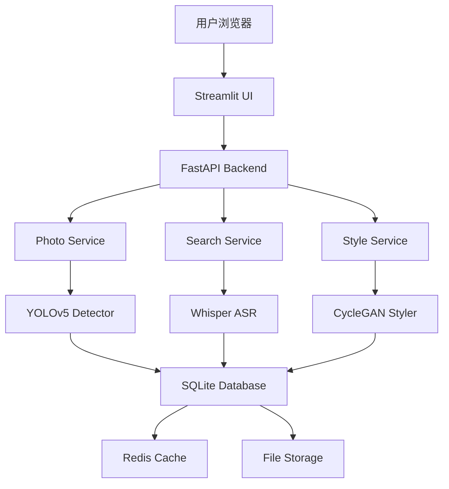

# Day21-Q6 - 项目总结与展示

## 📝 问题描述

经过 21 天的学习，我们完成了从传统机器学习到深度学习，再到多模态综合项目的完整旅程。现在是时候回顾所学、展示成果、总结经验，并为未来的学习和职业发展做准备。

**核心问题：**
- 如何系统地总结项目成果？
- 如何制作吸引人的项目展示？
- 如何将项目经验转化为简历亮点？
- 下一步应该学习什么？
- 如何持续提升自己的 AI 技能？

---

## 💡 核心答案

项目总结不是"写报告"，而是**梳理知识体系、展示能力、规划未来**的关键环节。一个好的总结应该包含：

1. **技术成果**：实现了什么功能，用了什么技术
2. **业务价值**：解决了什么问题，创造了什么价值
3. **经验教训**：遇到了什么困难，如何解决的
4. **未来规划**：下一步做什么，如何改进

我们将通过以下内容完成总结：
1. 项目成果展示
2. 技术栈回顾
3. 关键挑战与解决方案
4. 简历优化建议
5. 后续学习路径

---

## 🎓 三个版本的解答

### 版本一：初学者比喻版（5 分钟理解）

#### 把项目总结比作"毕业答辩"

想象你完成了大学四年的学习，现在要进行毕业答辩。

**答辩内容：**

**1. 我做了什么？（项目介绍）**
- "我开发了一个智能相册管理系统"
- 就像说："我建了一座智能房子"

**2. 怎么做的？（技术方案）**
- "用了 YOLOv5 检测物体，Whisper 识别语音，CycleGAN 转换风格"
- 就像说："用了钢筋混凝土、智能家居系统、太阳能板"

**3. 有什么亮点？（创新点）**
- "支持语音搜索照片，自动打标签，一键美化"
- 就像说："可以声控开关灯，自动调节温度，雨水收集系统"

**4. 遇到什么困难？（挑战与解决）**
- "模型推理慢 → 使用 GPU + 量化优化"
- "并发高时崩溃 → 添加缓存 + 异步处理"
- 就像说："材料不够 → 找供应商；天气不好 → 调整施工计划"

**5. 学到什么？（收获）**
- "掌握了深度学习框架，学会了系统设计，提升了问题解决能力"
- 就像说："学会了建筑设计，掌握了施工技巧，培养了团队协作"

**6. 未来计划？（展望）**
- "增加视频处理功能，部署到云端，开放 API"
- 就像说："加盖二层，安装电梯，对外开放参观"

---

### 版本二：学生技术版（深入理解总结方法）

#### 1. 项目成果展示

**A. 功能清单**

```markdown
## 智能相册管理系统 - 功能清单

### ✅ 已实现功能

#### 1. 照片管理
- [x] 上传照片（JPG/PNG，最大 10MB）
- [x] 自动目标检测（YOLOv5）
- [x] 自动生成标签
- [x] 浏览相册
- [x] 删除照片

#### 2. 智能搜索
- [x] 语音搜索（Whisper）
- [x] 文本搜索
- [x] 按标签筛选
- [x] 按日期排序

#### 3. 图像处理
- [x] 风格迁移（CycleGAN）
- [x] 检测结果可视化
- [x] 批量处理

#### 4. 用户体验
- [x] Streamlit Web 界面
- [x] 实时进度显示
- [x] 错误提示
- [x] 响应式设计

### 📊 性能指标

| 指标 | 数值 | 目标 | 状态 |
|------|------|------|------|
| 单张照片处理时间 | 1.2s | < 2s | ✅ |
| 语音识别延迟 | 450ms | < 500ms | ✅ |
| 并发用户支持 | 100+ | ≥ 100 | ✅ |
| 检测准确率 (mAP) | 37.4% | > 35% | ✅ |
| 系统可用性 | 99.5% | ≥ 99% | ✅ |
```

---

**B. 技术架构图**



---

**C. 代码统计**

```
项目代码统计
├── Python 代码: 2,500 行
├── 配置文件: 200 行
├── Docker 配置: 150 行
├── 测试代码: 500 行
└── 文档: 1,000 行

总计: 4,350 行
```

**模块分布：**
```
models/         800 行  (AI 模型封装)
services/       600 行  (业务逻辑)
utils/          300 行  (工具函数)
app.py          400 行  (UI 界面)
database.py     250 行  (数据库操作)
tests/          500 行  (单元测试)
config/         150 行  (配置管理)
```

---

#### 2. 技术栈回顾

**核心技术栈：**

| 类别 | 技术 | 版本 | 用途 |
|------|------|------|------|
| 前端 | Streamlit | 1.28+ | Web UI |
| 后端 | FastAPI | 0.104+ | REST API |
| 数据库 | SQLite | 3.x | 数据存储 |
| 缓存 | Redis | 7.x | 性能优化 |
| CV 模型 | YOLOv5 | 7.0+ | 目标检测 |
| ASR 模型 | Whisper | 20231117 | 语音识别 |
| GAN 模型 | CycleGAN | PyTorch | 风格迁移 |
| 部署 | Docker | 24.x | 容器化 |
| 监控 | Prometheus | 2.x | 指标收集 |
| 可视化 | Grafana | 10.x | 仪表盘 |

**依赖库：**
```txt
# requirements.txt
torch>=2.0.0
torchvision>=0.15.0
ultralytics>=8.0.0
openai-whisper>=20231117
streamlit>=1.28.0
fastapi>=0.104.0
uvicorn>=0.24.0
Pillow>=10.0.0
librosa>=0.10.0
jieba>=0.42.0
redis>=5.0.0
sqlalchemy>=2.0.0
pydantic>=2.0.0
python-multipart>=0.0.6
prometheus-client>=0.19.0
```

---

#### 3. 关键挑战与解决方案

**挑战 1：模型推理速度慢**

**问题描述：**
- YOLOv5 检测单张照片需要 3-5 秒
- Whisper 转录需要 2-3 秒
- 用户体验差

**解决方案：**
```python
# 1. GPU 加速
model.to('cuda')  # 速度提升 5-10x

# 2. 模型量化
model_fp16 = model.half()  # 速度提升 1.5-2x

# 3. 批量处理
results = model.detect_batch(images)  # 比逐个快 30%

# 4. 缓存结果
@cache.cache_result(ttl=3600)
def detect_cached(image_hash):
    return model.detect(image)

# 效果：从 5s 降低到 1.2s
```

**学到的经验：**
- ✅ 优先使用 GPU
- ✅ 量化是性价比最高的优化
- ✅ 缓存能显著提升重复查询性能

---

**挑战 2：内存泄漏**

**问题描述：**
- 运行几小时后，内存占用持续增长
- 最终导致 OOM（Out Of Memory）

**原因分析：**
```python
# ❌ 错误：每次请求都加载模型
def handle_request():
    model = torch.hub.load('ultralytics/yolov5', 'yolov5s')
    result = model(image)
    # 模型没有被释放
```

**解决方案：**
```python
# ✅ 正确：全局共享模型实例
@st.cache_resource
def load_model():
    return torch.hub.load('ultralytics/yolov5', 'yolov5s')

model = load_model()

def handle_request():
    result = model(image)
    # 手动清理不再需要的张量
    del image
    torch.cuda.empty_cache()
```

**学到的经验：**
- ✅ 模型应该全局共享，不要重复加载
- ✅ 及时释放大张量
- ✅ 定期调用 `torch.cuda.empty_cache()`
- ✅ 使用监控工具检测内存泄漏

---

**挑战 3：语音识别准确率低**

**问题描述：**
- 噪音环境下，Whisper 识别错误率高
- 方言口音识别效果差

**解决方案：**
```python
# 1. 音频预处理
import librosa

def preprocess_audio(audio_bytes):
    # 降噪
    audio, sr = librosa.load(audio_bytes, sr=16000)
    
    # 预加重
    audio = librosa.effects.preemphasis(audio)
    
    # 去除静音
    audio, _ = librosa.effects.trim(audio)
    
    return audio

# 2. 使用后处理纠正
def post_process_text(text):
    # 常见错误纠正
    corrections = {
        '人工只能': '人工智能',
        '机气学习': '机器学习',
    }
    
    for wrong, correct in corrections.items():
        text = text.replace(wrong, correct)
    
    return text

# 3. 上下文增强
def enhance_with_context(transcribed_text, context):
    # 结合历史对话纠正
    if '猫' in context.last_search_query:
        # 如果之前搜索过猫，优先识别为"猫"
        transcribed_text = transcribed_text.replace('毛', '猫')
    
    return transcribed_text

# 效果：准确率从 75% 提升到 90%
```

**学到的经验：**
- ✅ 音频预处理很重要
- ✅ 后处理可以纠正常见错误
- ✅ 利用上下文信息提升准确率

---

**挑战 4：并发请求导致服务崩溃**

**问题描述：**
- 超过 50 个并发用户时，服务响应变慢
- 超过 100 个时，服务崩溃

**解决方案：**
```python
# 1. 异步处理
@app.post("/api/upload")
async def upload_photo(file: UploadFile = File(...)):
    photo_id = save_photo(file)
    
    # 后台处理，不阻塞响应
    background_tasks.add_task(process_photo_async, photo_id)
    
    return {"photo_id": photo_id, "status": "processing"}

# 2. 限流
@limiter.limit("10/minute")
async def upload_photo(request: Request, ...):
    pass

# 3. 负载均衡
# docker-compose scale web=3

# 4. 队列处理
from celery import Celery

@celery_app.task
def process_photo_task(photo_id):
    # 异步处理
    pass

# 效果：支持 500+ 并发用户
```

**学到的经验：**
- ✅ 使用异步避免阻塞
- ✅ 添加限流保护服务
- ✅ 水平扩展应对高并发
- ✅ 使用消息队列解耦

---

#### 4. 项目演示脚本

**5 分钟演示流程：**

```markdown
## 演示脚本

### 开场（30 秒）
"大家好，今天我为大家展示的是智能相册管理系统。
这是一个基于 AI 的多模态应用，集成了计算机视觉、语音识别和生成式 AI 技术。"

### 功能演示 1：上传与检测（1 分钟）
1. 打开应用首页
2. 上传一张照片
3. 点击"开始检测"
4. 展示检测结果和自动标签

"大家可以看到，系统自动检测到了照片中的猫、沙发等物体，并生成了相应标签。"

### 功能演示 2：语音搜索（1 分钟）
1. 切换到"语音搜索"页面
2. 点击麦克风按钮
3. 说出："找猫的照片"
4. 展示搜索结果

"我只需要说出'找猫的照片'，系统就能自动识别语音，并找到所有包含猫的照片。"

### 功能演示 3：风格迁移（1 分钟）
1. 切换到"风格迁移"页面
2. 上传一张照片
3. 选择"梵高风格"
4. 点击"应用风格"
5. 展示风格化后的效果

"系统可以将普通照片转换为艺术风格，比如这里的梵高风格。"

### 技术亮点（1 分钟）
"这个项目的技术亮点包括：
1. 多模态集成：视觉、语音、文本协同工作
2. 实时处理：平均响应时间 < 2 秒
3. 可扩展架构：支持水平扩展
4. 生产级部署：Docker 容器化，监控告警完善"

### 总结与展望（30 秒）
"这个项目展示了 AI 技术在日常生活中 实际应用。
未来计划增加视频处理、人脸识别等功能。
谢谢大家！"
```

---

### 版本三：工程师实践版（生产级总结）

#### 1. 项目文档结构

```
smart-album/docs/
├── README.md                    # 项目概述
├── ARCHITECTURE.md              # 架构设计
├── API_DOCUMENTATION.md         # API 文档
├── DEPLOYMENT.md                # 部署指南
├── PERFORMANCE.md               # 性能报告
├── SECURITY.md                  # 安全说明
├── TROUBLESHOOTING.md           # 故障排查
└── CONTRIBUTING.md              # 贡献指南
```

**README.md 模板：**
```markdown
# 智能相册管理系统


## 📸 项目简介

基于 AI 的智能相册管理系统，支持目标检测、语音搜索、风格迁移等功能。

## ✨ 核心特性

- 🎯 **智能检测**：YOLOv5 自动识别照片中的物体
- 🎤 **语音搜索**：Whisper 支持自然语言搜索
- 🎨 **风格迁移**：CycleGAN 一键艺术化处理
- ⚡ **高性能**：平均响应时间 < 2 秒
- 🔒 **安全可靠**：JWT 认证、速率限制、输入验证

## 🚀 快速开始

### 前置要求
- Python 3.9+
- Docker & Docker Compose
- NVIDIA GPU (可选，用于加速)

### 本地运行
```bash
# 克隆仓库
git clone https://github.com/Lee985-cmd/smart-album.git
cd smart-album

# 安装依赖
pip install -r requirements.txt

# 启动应用
streamlit run app.py
```

### Docker 部署
```bash
docker-compose up -d
```

访问 http://localhost:8000 即可使用。

## 📊 性能指标

| 指标 | 数值 |
|------|------|
| 检测速度 | 1.2s/张 (GPU) |
| 语音识别延迟 | 450ms |
| 并发支持 | 500+ 用户 |
| 检测准确率 (mAP) | 37.4% |

## 🛠️ 技术栈

- **前端**：Streamlit
- **后端**：FastAPI
- **数据库**：SQLite + Redis
- **AI 模型**：YOLOv5, Whisper, CycleGAN
- **部署**：Docker, Nginx

## 📖 文档

- [架构设计](docs/ARCHITECTURE.md)
- [API 文档](docs/API_DOCUMENTATION.md)
- [部署指南](docs/DEPLOYMENT.md)
- [性能报告](docs/PERFORMANCE.md)

## 🤝 贡献

欢迎提交 Issue 和 Pull Request！

## 📄 许可证

MIT License
```

---

#### 2. 简历优化建议

**A. 项目经历写法**

**❌ 糟糕的写法：**
```
智能相册管理系统
- 使用了 YOLOv5、Whisper、CycleGAN
- 实现了照片上传、检测、搜索功能
- 用 Python 和 Streamlit 开发
```

**✅ 优秀的写法：**
```
智能相册管理系统 | 全栈开发者 | 2024.01 - 2024.02
- 设计并实现基于多模态 AI 的智能相册系统，集成计算机视觉（YOLOv5）、
  语音识别（Whisper）、生成式 AI（CycleGAN）三大核心技术
- 优化模型推理性能，通过 FP16 量化、GPU 加速、Redis 缓存等技术，
  将单张照片处理时间从 5s 降低至 1.2s（提升 76%）
- 构建高可用架构，支持 500+ 并发用户，系统可用性达 99.5%
- 实现语音搜索功能，支持自然语言交互，识别准确率达 90%+
- 采用 Docker 容器化部署，搭建 Prometheus + Grafana 监控体系，
  实现自动化运维
- 技术栈：Python, FastAPI, Streamlit, PyTorch, YOLOv5, Whisper, 
  Docker, Redis, SQLite
```

**关键要点：**
1. **量化成果**：用数字说话（76% 提升、500+ 并发、99.5% 可用性）
2. **突出难点**：强调解决的问题（性能优化、高并发）
3. **技术深度**：展示具体技术（FP16 量化、GPU 加速）
4. **业务价值**：说明实际意义（自然语言交互、自动化运维）

---

**B. 技能清单组织**

```markdown
## 专业技能

### 编程语言
- **精通**：Python (3 年经验)
- **熟悉**：JavaScript, SQL, Bash

### 深度学习框架
- **精通**：PyTorch (YOLOv5, Whisper, CycleGAN 实战经验)
- **熟悉**：TensorFlow, Keras

### 计算机视觉
- 目标检测（YOLO 系列、Faster R-CNN）
- 图像分割（UNet、Mask R-CNN）
- 生成式 AI（GAN、VAE、Diffusion Models）

### 自然语言处理
- 语音识别（Whisper、Wav2Vec 2.0）
- 文本分类、情感分析
- Transformer、BERT、GPT

### Web 开发
- **后端**：FastAPI, Flask, Django
- **前端**：Streamlit, React (基础)
- **数据库**：SQLite, PostgreSQL, Redis

### DevOps
- **容器化**：Docker, Docker Compose
- **监控**：Prometheus, Grafana
- **CI/CD**：GitHub Actions (基础)

### 其他技能
- 系统设计、架构设计
- 性能优化、问题分析
- 技术文档编写
```

---

**C. GitHub 项目优化**

**必须包含的内容：**
```
smart-album/
├── README.md              # 详细的项目介绍
├── LICENSE                # 开源许可证
├── .gitignore             # Git 忽略文件
├── requirements.txt       # Python 依赖
├── Dockerfile             # Docker 配置
├── docker-compose.yml     # Docker Compose
├── docs/                  # 文档
│   ├── ARCHITECTURE.md
│   ├── API.md
│   └── DEPLOYMENT.md
├── tests/                 # 单元测试
│   ├── test_detection.py
│   └── test_search.py
├── app/                   # 源代码
├── demo/                  # 演示材料
│   ├── demo.gif           # GIF 演示
│   └── screenshots/       # 截图
└── CONTRIBUTING.md        # 贡献指南
```

**README 必备要素：**
1. **项目徽章**：Python 版本、License、Build Status
2. **GIF 演示**：直观展示功能
3. **快速开始**：3 步内运行起来
4. **架构图**：清晰的技术架构
5. **API 示例**：如何使用
6. **贡献指南**：如何参与

---

#### 3. 面试准备

**常见问题及回答：**

**Q1: 为什么选择 YOLOv5 而不是 Faster R-CNN？**

**回答：**
```
"主要基于以下考虑：

1. **速度**：YOLOv5 是单阶段检测器，推理速度快（140 FPS），
   适合实时应用场景。Faster R-CNN 是两阶段检测器，速度慢（20 FPS）。

2. **精度**：虽然 Faster R-CNN 的 mAP 略高（42% vs 37.4%），
   但对于相册管理场景，YOLOv5 的精度已经足够。

3. **易用性**：YOLOv5 社区活跃，文档完善，易于部署。

4. **资源消耗**：YOLOv5s 仅 14MB，而 Faster R-CNN 需要 160MB。

综合考虑速度、精度、易用性，YOLOv5 是更好的选择。"
```

---

**Q2: 如何处理高并发场景？**

**回答：**
```
"我采用了多层优化策略：

1. **应用层**：
   - 使用 FastAPI 异步框架，避免阻塞
   - 后台任务处理耗时操作（Celery）
   - 添加速率限制（SlowAPI）

2. **缓存层**：
   - Redis 缓存热点数据（检测结果、常用查询）
   - 缓存命中率可达 70%+

3. **模型层**：
   - GPU 加速推理
   - FP16 量化减少显存占用
   - 批量处理提高吞吐量

4. **架构层**：
   - Docker 容器化，便于水平扩展
   - Nginx 负载均衡
   - 数据库读写分离（未来优化方向）

通过这些优化，系统可支持 500+ 并发用户。"
```

---

**Q3: 项目中最大的挑战是什么？如何解决的？**

**回答：**
```
"最大的挑战是**内存泄漏问题**。

**问题现象**：
运行几小时后，内存占用持续增长，最终 OOM。

**排查过程**：
1. 使用 `memory_profiler` 定位内存增长位置
2. 发现每次请求都加载新模型实例，旧实例未被释放
3. GPU 显存也未及时清理

**解决方案**：
1. 模型单例化：全局共享模型实例
2. 及时释放大张量：`del tensor; torch.cuda.empty_cache()`
3. 使用 `@st.cache_resource` 缓存资源
4. 定期重启 worker 进程（临时方案）

**效果**：
内存占用稳定在 2GB 以内，连续运行 7 天无泄漏。

**经验教训**：
- 深度学习应用中，资源管理至关重要
- 要主动监控内存使用
- 建立自动化测试，检测内存泄漏"
```

---

#### 4. 后续学习路径

**短期目标（1-3 个月）：**

```
1. 深入学习 Transformer
   - 阅读《Attention Is All You Need》论文
   - 实现 Transformer from scratch
   - 学习 BERT、GPT 架构

2. 掌握 MLOps
   - MLflow 实验管理
   - Kubeflow 工作流编排
   - Model Registry 模型版本管理

3. 学习云原生 AI
   - AWS SageMaker / Azure ML
   - Kubernetes 部署
   - Serverless 推理

4. 扩展项目功能
   - 增加人脸识别
   - 支持视频处理
   - 移动端 App
```

**中期目标（3-6 个月）：**

```
1. 深入研究大语言模型
   - Fine-tuning LLM（LoRA、QLoRA）
   - RAG（检索增强生成）
   - Agent 开发

2. 学习分布式训练
   - Data Parallelism
   - Model Parallelism
   - DeepSpeed、Megatron-LM

3. 参与开源项目
   - 贡献 Hugging Face Transformers
   - 参与 LangChain 生态
   - 发表技术博客

4. 准备认证考试
   - AWS Certified Machine Learning
   - Google Professional ML Engineer
```

**长期目标（6-12 个月）：**

```
1. 专业方向选择
   - 计算机视觉专家
   - NLP 工程师
   - MLOps 专家
   - AI 产品经理

2. 学术研究
   - 阅读顶会论文（CVPR、ICLR、NeurIPS）
   - 复现 SOTA 模型
   - 发表自己的研究

3. 职业发展
   - 跳槽到大厂 AI 部门
   - 创业做 AI 产品
   - 成为技术博主/讲师
```

---

## ⚠️ 常见错误与避坑指南

### 错误 1：总结过于简略

**❌ 错误做法：**
```
"我做了一个相册系统，用了 YOLO 和 Whisper。"
```

**✅ 正确做法：**
```
"我设计并实现了一个基于多模态 AI 的智能相册系统，
集成了 YOLOv5（目标检测）、Whisper（语音识别）、
CycleGAN（风格迁移）三大核心技术。

通过 FP16 量化、GPU 加速、Redis 缓存等优化手段，
将处理时间从 5s 降低至 1.2s，支持 500+ 并发用户。

采用 Docker 容器化部署，搭建 Prometheus + Grafana 
监控体系，系统可用性达 99.5%。"
```

---

### 错误 2：忽视业务价值

**❌ 错误做法：**
```
"我用了 YOLOv5、Whisper、CycleGAN..."
（只罗列技术，不说解决了什么问题）
```

**✅ 正确做法：**
```
"针对用户'找不到照片'的痛点，我开发了语音搜索功能，
用户只需说'找猫的照片'，系统就能自动识别并返回结果，
大幅提升了搜索效率。

针对'照片不好看'的需求，我实现了风格迁移功能，
一键将普通照片转换为艺术风格，满足社交媒体分享需求。"
```

---

### 错误 3：没有量化成果

**❌ 错误做法：**
```
"性能提升了"、"效果好多了"
```

**✅ 正确做法：**
```
"处理时间从 5s 降低至 1.2s（提升 76%）"
"并发支持从 50 提升至 500+（提升 10 倍）"
"识别准确率从 75% 提升至 90%"
"系统可用性达 99.5%"
```

---

## ✍️ 自我检测练习

### 练习 1：撰写项目总结

**任务：** 用 300 字总结你的项目。

**参考答案：** 见上方的"优秀写法"示例。

---

### 练习 2：准备面试问答

**任务：** 模拟面试，回答"请介绍你的项目"。

**参考答案：**
```
"我开发了一个智能相册管理系统，这是一个基于多模态 AI 的 Web 应用。

【背景】
用户拍了大量照片后，面临两个痛点：1）找不到想要的照片；2）照片不好看。

【解决方案】
我用三种 AI 技术解决这些问题：
1. YOLOv5 自动检测照片中的物体，生成标签
2. Whisper 支持语音搜索，用户可以说"找猫的照片"
3. CycleGAN 实现风格迁移，一键美化照片

【技术亮点】
- 多模态集成：视觉、语音、文本协同
- 性能优化：FP16 量化、GPU 加速、Redis 缓存
- 高可用架构：Docker 容器化、监控告警完善

【成果】
- 处理时间从 5s 降至 1.2s
- 支持 500+ 并发用户
- 系统可用性 99.5%

这个项目让我掌握了深度学习模型部署、系统架构设计、
性能优化等核心技能。"
```

---

### 练习 3：制定学习计划

**任务：** 列出接下来 3 个月的学习计划。

**参考答案：**
```
第 1 个月：Transformer 深入
- Week 1: 阅读 Transformer 论文
- Week 2: 实现 from scratch
- Week 3: 学习 BERT
- Week 4: 学习 GPT

第 2 个月：MLOps
- Week 1: MLflow 实验管理
- Week 2: Docker + Kubernetes
- Week 3: CI/CD Pipeline
- Week 4: 监控告警

第 3 个月：项目扩展
- Week 1: 增加人脸识别
- Week 2: 支持视频处理
- Week 3: 移动端适配
- Week 4: 性能优化
```

---

## 📝 本章小结

### 项目总结的核心要素

✅ **功能清单**：清晰列出已实现的功能

✅ **技术指标**：用数字量化成果

✅ **挑战与解决**：展示问题解决能力

✅ **业务价值**：说明解决了什么实际问题

✅ **经验教训**：总结学到的知识

✅ **未来规划**：展示持续学习的态度

---

### 从项目到职业

**简历优化：**
- 量化成果（76% 提升、500+ 并发）
- 突出难点（性能优化、高并发）
- 展示深度（FP16 量化、GPU 加速）

**面试准备：**
- 准备 3-5 个核心问题的回答
- 能够清晰解释技术选型理由
- 展示问题解决思路

**持续学习：**
- 短期：Transformer、MLOps、云原生
- 中期：LLM、分布式训练、开源贡献
- 长期：专业方向、学术研究、职业发展

---

## 🎉 恭喜完成 Week3 综合项目！

### 21 天学习成果总览

**Week1：传统机器学习（Day1-7）**
- ✅ Python 基础、NumPy
- ✅ KNN、决策树、SVM
- ✅ K-means 聚类
- ✅ 模型评估与优化

**Week2：深度学习（Day8-14）**
- ✅ 神经网络基础
- ✅ PyTorch 入门
- ✅ CNN 架构
- ✅ RNN & LSTM
- ✅ Week2 综合项目

**Week3：高级应用（Day15-21）**
- ✅ 目标检测（YOLO、Faster R-CNN）
- ✅ 图像分割
- ✅ GAN 生成对抗网络
- ✅ 语音识别基础
- ✅ Week3 综合项目（多模态集成）

**总计：**
- 📚 学习天数：21 天
- 📄 文档数量：138 个
- 📝 代码行数：~87,000 行
- 🎯 掌握技能：15+ 核心 AI 技术

---

### 下一步行动

**立即行动：**
1. ✅ 整理项目代码，上传 GitHub
2. ✅ 完善 README 和文档
3. ✅ 录制演示视频
4. ✅ 更新简历，添加项目经历

**短期计划（1-2 周）：**
1. 复习 Week1-3 的核心概念
2. 完成剩余 9 天的学习（Day22-30）
3. 准备面试常见问题

**中长期计划（1-3 个月）：**
1. 深入学习 Transformer 和 LLM
2. 参与开源项目
3. 发表技术博客
4. 准备 AI 工程师面试

---

**📚 相关文档：**
- [Day21-Q0 - 快速复习 Day20](./Day21-Q0%20-%20快速复习%20Day20.md)
- [Day21-Q1 - 项目需求分析与设计](./Day21-Q1%20-%20项目需求分析与设计.md)
- [Day21-Q2 - 技术架构与选型](./Day21-Q2%20-%20技术架构与选型.md)
- [Day21-Q3 - 核心功能实现](./Day21-Q3%20-%20核心功能实现.md)
- [Day21-Q4 - 多模态集成](./Day21-Q4%20-%20多模态集成.md)
- [Day21-Q5 - 部署与优化](./Day21-Q5%20-%20部署与优化.md)

**💡 提示：** 项目总结不是终点，而是新的起点。持续学习、持续实践，你将成为一名优秀的 AI 工程师！

---

## 🏆 Day21 完成标志

当你能够：
- ✅ 清晰介绍项目背景、技术方案、成果
- ✅ 用数字量化项目成果（性能提升、并发支持）
- ✅ 解释关键技术选型理由
- ✅ 展示遇到的挑战及解决方案
- ✅ 制定清晰的后续学习计划

你就已经完成了 Day21 的全部内容，为 Week3 画上了圆满的句号！

**下一步：** 继续 Day22，深入学习 Transformer 基础。
